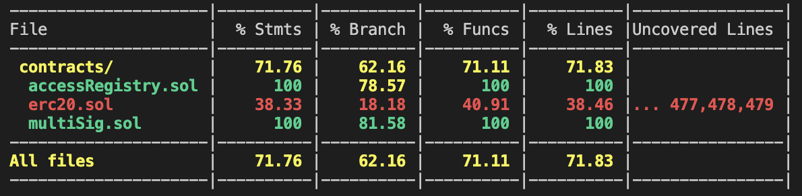

# Multi Sig Wallet Contract

- Multi-Sig wallet is more secure than an ordinary wallet as it has more than one member to validate/approve transaction to get executed.

- In this contract it requires 60% of members/partners to confirm/validate/approve to execute transaction.

- owner of the contract has power of pausing/unpausing the access of partners, And to add new partners.


Since solidity doesn't support decimals so it takes only number such as 
```
// there 6 members/partners of the contract
partners = 6 

// to execute transaction 
noOfConfirmationNeeded = ( 6 * 60 ) / 100 = 3.6 = 3 
// so it will require 3 members
```
## Test Coverage


## Installation

```javascript
// to install all dependencies
npm install
```

## Usage

```javascript
// to run unit test
npx hardhat test

// to run unit test with gas report
GAS_REPORT=true npx hardhat test

// to check test coverage
npx hardhat coverage

// to check other options
npx hardhat help
```

## Explanation
### Events
- `ContractOwnerChange` event get emitted when owner has been changed
- `newPartner` event get emitted when new partner gets added
- `Deposit` when someone deposit ETH
- `SubmitTransaction` when one of the partner submit new transaction 
- `ConfirmTransaction` when one of the partner validate transaction
- `RevokeConfirmation` when one of the partner revoke the confirm transaction
- `ExecuteTransaction` when transaction gets executed

### State Variables
- uint8 `percentageOfConfirmationNeeded` is the percentage of partners that needs to be confirm in order to execute transaction
- struct `Transaction` to store transaction details which is then been stored in `array` name `transactions`
- address `owner` stores owner of the contract
- bool `isPausedForAll` store weather owner has pause the access of partners
- mapping `isPartner` to store weather address is partner or not
- array `partners` to get know how many partners we have

### Modifiers
- `txExists` to check that received tx is an valid tx id
- `notExecuted` to check weather the transaction has executed or not
- `notConfirmed` to check weather caller has confirm/validate the transaction before
- `onlyContractOwner` to check weather caller is owner or not
- `onlyPartners` to check weather caller is one of the paartners or not
- `hasNotPaused` to check weather owner has paused the access of partners or not

### Constructors
- `multiSig` constructor takes an address of array as an parameter to add new partners 
- `accessRegistry` constructor assign owner variable with the deployer of the contract 

### Functions
- `getContractOwner` public function returns current owner address
- `isPartnerOrNot` public function take address as an parameter and returns if it is partner or not
- `setContractOwner` function can only be called by owner to transfer ownership to other address
- `addNewPartner` function can only be called by owner to add new partner
- `pauseAllPartners` function can only be called by owner to pause access of partners
- `unpauseAllPartners` function can only be called by owner to unpause access of partners
- `submitTransaction` function can only be called by partners to submit transaction
- `confirmTransaction` function can only be called by partners to validate transaction 
- `revokeConfirmation` function can only be called by partners to revoke transaction after confirming 
- `executeTransaction` function can only be called by partners to execute transaction
- `calculateConfirmationLeft` function to calculate confirmation/validation needed to execute transaction 
- `getPartners` to get the array of partners list
- `getTransactionCount` function to get total transaction
- `getTransaction` function to get specific transaction details by its id

## Contributing
Pull requests are welcome. For major changes, please open an issue first to discuss what you would like to change.

Please make sure to update tests as appropriate.

## License
None